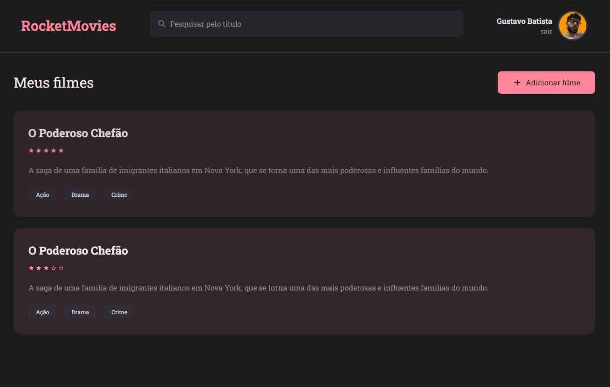

<h1 align="center"> Front-end desafio 10 - Rocketseat </h1>

## 💻 Projeto

O projeto consiste em o front-end de uma aplicação para acompanhar tudo que assistir. O projeto foi desenvolvido durante o bootcamp da Rocketseat.

Me desafiei a desenvolver o prejeto utilizando o framework TailwindCSS, que é um framework de CSS que utiliza classes para estilizar os componentes e TypeScript, que é um super set do JavaScript que adiciona tipagem estática.

## Funcionalidades:

- Criar uma nova conta
- Logar na aplicação
- Cadastro de filmes; Título, Nota de 0 a 5, Observações, e tags que representam o gênero do filme.
- Excluir um filme
- Editar um filme
- Editar o perfil do usuário; foto, nome, email e senha.

  <a href="#-tecnologias">Tecnologias</a>&nbsp;&nbsp;&nbsp;|&nbsp;&nbsp;&nbsp;
  <a href="#-projeto">Projeto</a>&nbsp;&nbsp;&nbsp;&nbsp;&nbsp;&nbsp;</a>

 

  

## 🚀 Tecnologias

Esse projeto foi desenvolvido com as seguintes tecnologias:

- [React](https://reactjs.org)
- [TypeScript](https://www.typescriptlang.org/)
- [Vite](https://vitejs.dev/)
- [TailwindCSS](https://tailwindcss.com/)
- [React Router Dom](https://reactrouter.com/web/guides/quick-start)
- [react-icons](https://react-icons.github.io/react-icons/)

## 🚀 TODO:

- Integração com o back-end

---

Feito com ♥ by Gustavo Batista :wave: [LinkedIn](https://www.linkedin.com/in/gustavo-h-batista/) e [GitHub](https://github.com/gustavohdab)
